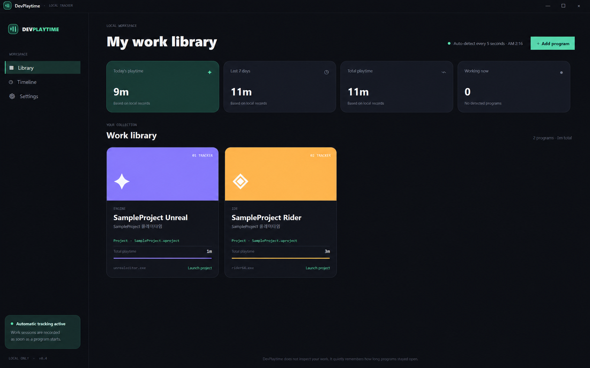
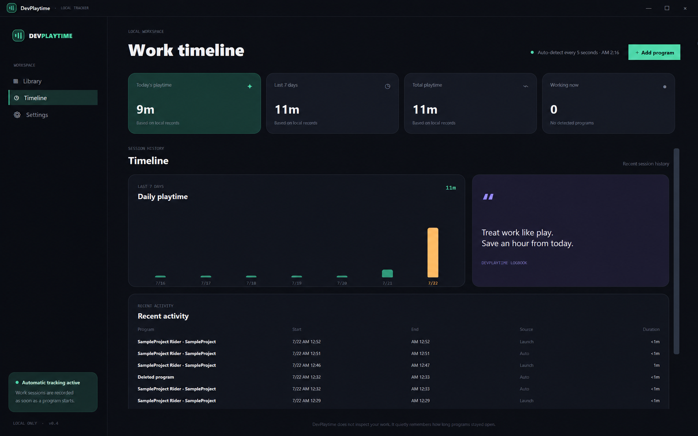
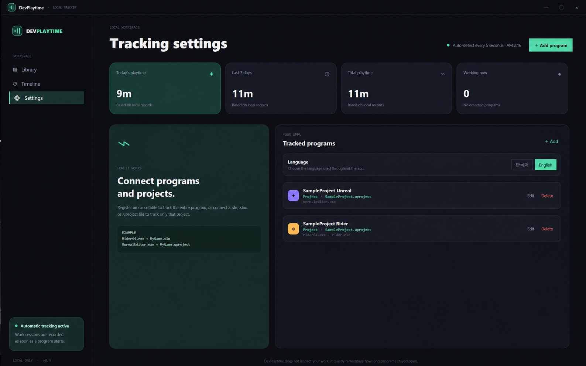

# DevPlaytime

DevPlaytime is a local Windows desktop app that records how long development tools and individual projects stay open.

DevPlaytime은 개발 프로그램과 개별 프로젝트가 켜져 있던 시간을 로컬에 기록하는 Windows 데스크톱 앱입니다.

## Features / 주요 기능

- Automatic process tracking every five seconds / 5초 간격 프로세스 자동 감지
- Program-level and project-level playtime / 프로그램 및 프로젝트별 플레이타임
- `.sln`, `.slnx`, and `.uproject` tracking
- Library, timeline, and settings views / 라이브러리, 타임라인, 설정 화면
- Korean and English UI with saved language preference / 한국어·영어 UI 및 언어 설정 저장
- Custom accent colors with a color wheel / 색상환을 이용한 포인트 컬러 선택
- Popular app presets with color and text icons / 색상과 문자 아이콘이 포함된 인기 앱 프리셋
- Running-app picker with executable icon extraction / 실행 중인 앱 선택 및 실행 파일 아이콘 추출
- Background tracking through the system tray / 시스템 트레이 백그라운드 추적
- Single-instance behavior that restores the existing window / 중복 실행 시 기존 창 복원
- Local JSON storage with no network communication / 네트워크 통신 없는 로컬 JSON 저장

## Screenshots / 스크린샷

### Library / 라이브러리



### Timeline / 타임라인



### Settings / 설정



## Run / 실행

Download the latest release and run `DevPlaytime.exe`. The framework-dependent build requires the .NET 10 Desktop Runtime on Windows x64.

최신 릴리스의 `DevPlaytime.exe`를 실행하세요. 현재 배포본은 Windows x64용 .NET 10 Desktop Runtime이 필요합니다.

- `start-desktop.bat`: start normally / 일반 실행
- `start-background.bat`: start hidden in the system tray / 시스템 트레이로 백그라운드 실행

Minimizing keeps the app on the taskbar. Closing the window hides it in the system tray, where `Exit DevPlaytime` / `완전히 종료` closes it completely.

## Build from source / 소스 빌드

Install the .NET 10 SDK, then run:

```powershell
dotnet restore
dotnet run --project DevPlaytimeDesktop.csproj
```

Create a Release build with:

```powershell
dotnet publish DevPlaytimeDesktop.csproj --configuration Release --self-contained false --output publish-latest
```

`publish-latest` is ignored by Git. Attach packaged binaries to GitHub Releases instead of committing them to the source repository.

## License / 라이선스

DevPlaytime is open-source software licensed under the [MIT License](LICENSE).

DevPlaytime은 [MIT 라이선스](LICENSE)로 공개되는 오픈소스 소프트웨어입니다.

## Project tracking / 프로젝트별 추적

Edit a tracker in Settings and connect a `.sln`, `.slnx`, or `.uproject` file. DevPlaytime records time only when that exact project path appears in the tracked process command line. Leave the project field empty to track the entire program.

설정에서 추적 항목을 편집하고 `.sln`, `.slnx`, `.uproject` 파일을 연결하면 해당 프로젝트 경로가 프로세스 명령줄에서 확인될 때만 시간을 기록합니다. 프로젝트 파일을 비워두면 프로그램 전체 시간을 기록합니다.

## Adding a tracker / 추적 항목 등록

The following fields appear when you select `Add program` / `프로그램 추가`.

`Add program` / `프로그램 추가`를 선택하면 다음 항목을 입력할 수 있습니다.

Use `Running apps` to select a program that is currently open, or `Popular apps` to fill common executable names automatically. You can still type executable names directly.

`실행 중 앱`에서 현재 열려 있는 프로그램을 선택하거나 `인기 앱`에서 자주 쓰는 실행 파일 이름을 자동으로 입력할 수 있습니다. 실행 파일 이름을 직접 입력하는 방식도 계속 지원합니다.

| Field / 항목 | What to enter / 입력 내용 | Example / 예시 |
| --- | --- | --- |
| Program name / 프로그램 이름 | Required. The name displayed in the library. / 필수. 라이브러리에 표시할 이름입니다. | `Blender`, `Rider`, `My Game` |
| Executable names / 실행 파일 이름 | Required. Enter the process executable name. Separate multiple names with commas. / 필수. 감지할 프로세스의 실행 파일 이름을 입력합니다. 여러 이름은 쉼표로 구분합니다. | `blender.exe`, `rider64.exe, rider.exe` |
| Category / icon / 분류·아이콘 | Display-only category and icon. These do not affect tracking. / 화면에 표시할 분류와 아이콘이며 추적 방식에는 영향을 주지 않습니다. | `IDE`, `ENGINE`, `PROGRAM` |
| Short description / 한 줄 설명 | A short description displayed on the library card. / 라이브러리 카드에 표시할 짧은 설명입니다. | `3D modeling time` |
| Accent color / 포인트 컬러 | The representative color used by the program card. / 프로그램 카드에 사용할 대표 색상입니다. | `#29D3A2` |
| Project file / 프로젝트 파일 | Optional. Select an exact `.sln`, `.slnx`, or `.uproject` to track only that project. Leave it empty to track the entire program. / 선택 사항. 특정 프로젝트만 기록하려면 정확한 `.sln`, `.slnx`, `.uproject` 파일을 선택합니다. 프로그램 전체를 기록하려면 비워둡니다. | `C:\Projects\SampleProject\SampleProject.uproject` |

### Quick examples / 빠른 예시

To track an entire app such as Blender, enter a program name and `blender.exe`, then leave the project file empty.

Blender 같은 일반 앱 전체를 추적하려면 프로그램 이름과 `blender.exe`를 입력하고 프로젝트 파일은 비워두세요.

To track Rider only while a specific Unreal Engine project is open, enter `rider64.exe, rider.exe` and connect that project's `.uproject` file.

특정 Unreal Engine 프로젝트를 Rider로 열어둔 시간만 추적하려면 `rider64.exe, rider.exe`를 입력하고 해당 프로젝트의 `.uproject` 파일을 연결하세요.

You can find an executable name in the Windows Task Manager `Details` tab or in the application's installation folder.

실행 파일 이름은 Windows 작업 관리자의 `세부 정보` 탭이나 프로그램 설치 폴더에서 확인할 수 있습니다.

## Language / 언어

New installations start with an empty library and automatically use the Windows display language. Korean Windows installations start in Korean; other display languages use English. Open Settings and select `한국어` or `English` to override it. The selection is applied immediately and saved for the next launch.

새로 설치하면 빈 라이브러리로 시작하며 Windows 표시 언어를 자동으로 사용합니다. Windows 표시 언어가 한국어면 한국어로, 그 외 언어면 영어로 시작합니다. 설정에서 `한국어` 또는 `English`를 선택하면 즉시 적용되며 다음 실행에도 유지됩니다.

## Data and privacy / 데이터와 개인정보

All data stays in `%LOCALAPPDATA%\DevPlaytime\devplaytime.json`. DevPlaytime does not send data over the internet or inspect project contents.

모든 기록은 `%LOCALAPPDATA%\DevPlaytime\devplaytime.json`에 저장됩니다. 인터넷으로 데이터를 전송하거나 프로젝트 내용을 읽지 않습니다.
